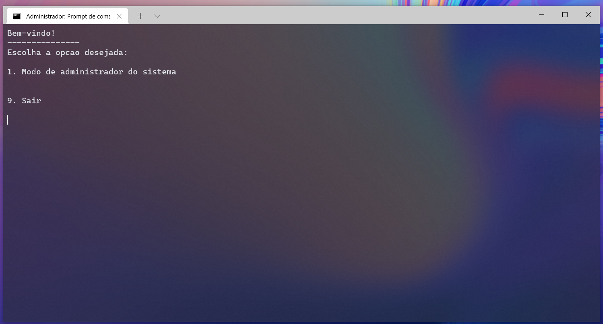
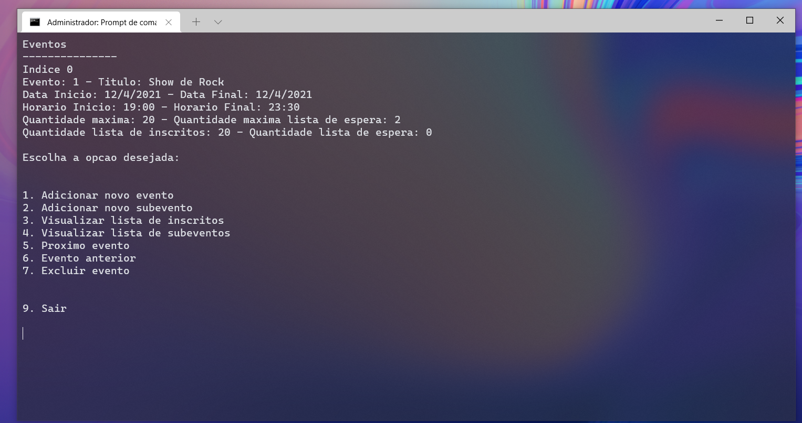

# Sistema de Eventos

Esse programa foi desenvolvido para a disciplina Estrutura de Dados, do curso de Ciência da Computação da UNIVALI.

Ele conté definições para listas genéricas de diversos tipos, sejam: estática, encadeada e duplamente encadeada.
Além disso, ele contém uma biblioteca desenvolvida por mim, para gerênciar um sistema de eventos, com um sistema de inscrições, lista de espera, criação e alteração de eventos, subeventos e listas de inscritos/espera, armazenamento de dados de data e horário.

Tudo isso em C++, e linha de comando, com uma interface que exibe todos os dados necessários para gerenciar as várias listas.

Imagens:

